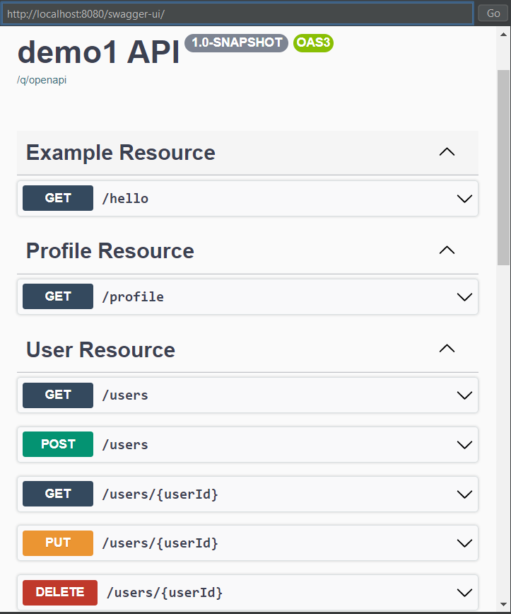
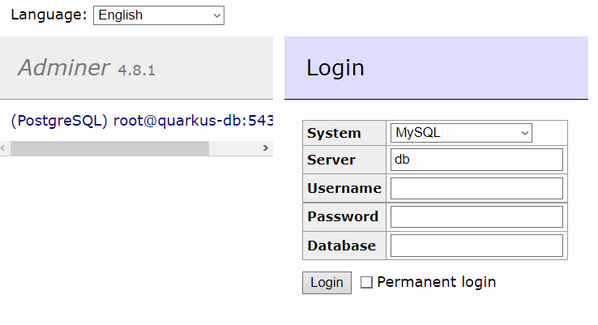
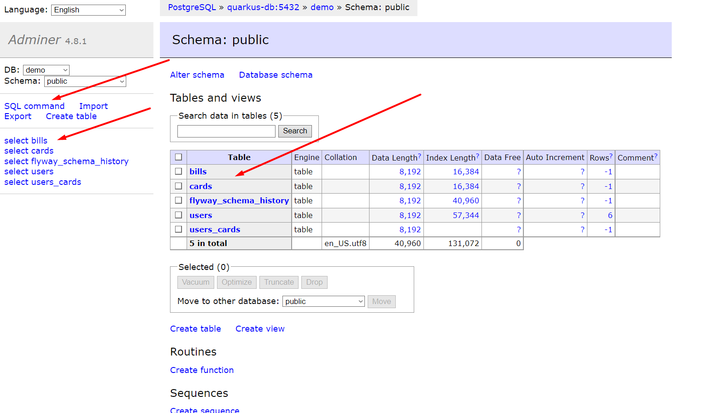

# Отчёт для университета

## Цель проекта

Познакомиться с популярными технологиями, микросервисной архитектурой. 
Создать маленькое микросервисное приложение используя эти технологии.

## Пару слов о структуре

Приложение представляет собой два простых микросервиса, 
которые взаимодействуют между собой посредством HTTP-запросов

+ demo1 microservice - является **'сердцем'** приложения, 
представляет собой единую точку, с которой можно 
взаимодействовать посредством HTTP-запросов 
(просмотреть все доступные ендпоинты можно на http://localstack:8080/swagger-ui),
данный микросервис имеет свою собственную базу данных. Пример как это выглядит:





+ contact microservice - является вспомогательным для **demo1 microservice**, 
его цель хранение, управление и предоставление информации о контактах юзера, 
имеет свою собственную базу данных


## Используемые технологии

+ Java Core - язык на котором написано приложение
+ Quarkus - удобный фреймворк для быстрого создания микросервисов (очень похож на Spring Framework)
+ Flyway - инструмент для миграции баз данных, своего рода контроль версий базы данных
+ Swagger - инструмент для ведения документации API, так же с её помощью можно легко протестировать запросы
+ Hibernate ORM with Panache - библиотека Quarkus'а для упрощения задач ORM, работает по принципу паттерна ActiveRecord
+ Quartz (scheduler) - инструмент для создания Job, которые будут отрабатывать по какому то Trigger'у
+ PostgresSQL - популярная реляционная база данных
+ Maven - для автоматизации сборки проектов (все зависимости прописаны в pom.xml файле)
+ okHTTP - низкоуровневый инструмент для отправки HTTP-запросов програмным образом
+ Quarkus JUnit, Mockito - инструменты для юнит, мок тестирования 
+ MapStruct, Lombok - инструменты для генерации кода экономит время при разработке
+ Docker - програмное обеспечение для контейниризации


## Как запустить

> Важно! Если хотите запустить локально не забудьте 
> сменить конфигурацию на вашу (такую как пароли к базе данных и прочее)

Можно запустить двумя способами, через docker-compose или командную строку.

1. Quarkus предоставляет удобный механизм для запуска проекта локально 
и обновляет изменения в проекте динамически (здорово ускоряет процесс разработки). 
При запуске Quarkus самостоятельно поднимает докер контейнеры с приложением, базой данных и
от вас ничего не требуется только чтобы у вас был запущен докер на компьютере. Для запуска приложения таким 
путем выполните команду в рутовой директории проекта
```
.\mvnw compile quarkus:dev
```

2. Так же написан docker-compose файл который состоит из приложения, базы данных, и админера для базы данных.
Последнее можно использовать для локального доступа к базе данных (http://localhost:8080). Для того чтобы запустить 
таким путем выполните команду в рутовой директории проекта
```
docker-compose up

или

docker-compose up -d
```

Интерфейс админера (через него вы можете посмотреть состояние текущей базы данных, выполнить SQL запросы):




## Описание работы проекта

### Части проекта

Проект можно разделить на три части (слоя):
- Model - хранит в себе DTO-объекты, Entity-объекты, и Mapper-ы.
  + Каждый Entity-объект является ActiveRecord pattern реализацией, 
  и так же промаплен соответственно объекту базы данных, хранит SQL-запросы
  для взаимодействия с базой данных.
  + DTO-объекты (Data Transfer Object) является оболочкой для хранения\оброботки.
  + Mapper-ы это классы для отображение DTO-объектов в Entity-объекты и наоборот.
- Service - непосредственно бизнес логика заключена в этих классах, в силу простоты приложения, там нет ничего
сверх сложного, простое взаимодействие с базой данных через Entity-объект, перемапливание в DTO-объект и возвращение
его как результата. Так же, есть особенный сервис, через который происходит взаимодейтсвие с другим микросервисом (contact).
Я описал две реализации этого, используя функционал фреймворка Quarkus (ярким недостатком которого является невозможным 
более детальная конфигурация исходящих запросов) и второй используя библиотеку okHTTP (сам же Quarkus *под капотом* использует 
эту же библиотеку).
- Resource (REST controller) - сами контроллеры, которые принимают из вне HTTP-запросы в UserResource поддерживаются только
GET-, POST-, PUT-, DELETE- запросы, то что они делают интуитивно понятно
  + GET: получить всех юзеров, или по айди
  + POST: добавить нового юзера
  + PUT: изменить юзера по айди
  + DELETE: удалить юзера по айди
  
> Так же есть scheduler-слой, которая хранит в себе Job которые отрабатывают по заданому триггеру,
> реализован максимально примитивный шедулер, который каждые 30 секунд пишет сообщение в логи. 

### Жизненный цикл проекта

Кто-то отправляет http-запрос, на чтение\добавление\обновление\удаления базы данных после чего

Отрабатывают сервисы и так же отправляется запрос к другому микросервису на чтение\добавление\обновление\удаления
контактной информации юзера, после чего эти сервисы формируют DTO-объект и отправляют его как response, 
сделавший http-запрос получает ответ в виде json файла (Quarkus берет на себя работу по трансформации DTO в json).

Так же есть шедулер, который каждые 30 секунд создает логи приложения. 

Основная работа проделана в UserResource, где так же происходит взаимодействие с другим микросервисом,
но так же есть ProfileResource, который возвращает профиль с который сейчас используется, 
и CardResource где в основном работа была с транзакциями (перевод платежей с одной карточки, на другую) так же посредством 
http-запросов. 

Так же были написаны unit, mock тесты для UserResource.

> К слову о профилях, это приложение имеет три профиля,
> 1. %test - используется при запуске тестов (конектится к своей базе данных, которая автоматически создается и дропается)
> 2. %dev - используется по умолчанию при запуске приложения (конектится к своей базе данных, которая автоматически создается и дропается)
> 3. %prod - можно указать в VM Options чтобы приложение запускалось с этим профилем, подключается к уже существующей базе данных
> проверяя каждый раз, установлена ли актуальная её версия (Flyway) если да, то пишет что всё хорошо и продолжается запуск приложения,
> если есть новые версии то обновит базу данных и продолжит запуск приложения
> 
> В каждом из этих профилей есть свои конфигурации.

Касательно, второго микросервиса, он представляет собой похожую на этот микросервис структуру, 
так же есть слои model, service, resource которые взаимодествуют со своей базой данных и возвращают json 
в ответ на каждый из запросов. Посмотреть код этого микросервиса можно так же на гитхабе 

```
https://github.com/RomanDenysov/contact-microservice
```
